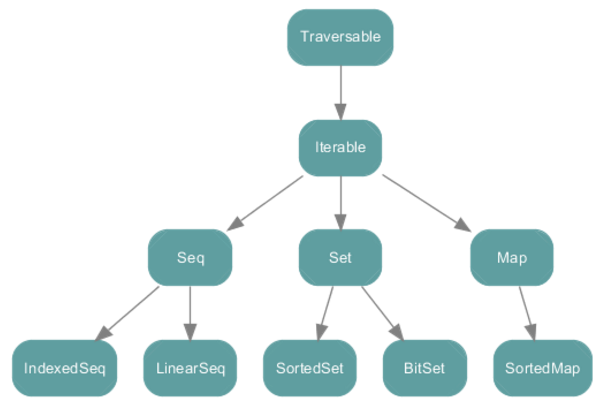

# 在IDEA中打开Scala Console
Tools -> Run Scala Console （必须选中某个scala文件，否则没有这个选项）
注意：这种模式相当于:paste模式，你必须用Ctrl+Enter才能执行代码。

# 基础知识

[DataDemo.scala](DataDemo.scala)

[DateDemo.scala](DateDemo.scala)

[正则表达式](Regexp.scala)

[2,12 控制结构和函数](ControlAndFunction.scala)

再深化一下

[13 集合](CollectionDemo.scala)

[14 模式匹配](MatchDemo.scala)

[21 隐式转换](ImplicitDemo.scala)

# 其他
[常用设计模式](designpattern)

[在线反编译网址](http://www.javadecompilers.com/)

[NoDecompile防止反编译](NoDecompile.scala)

